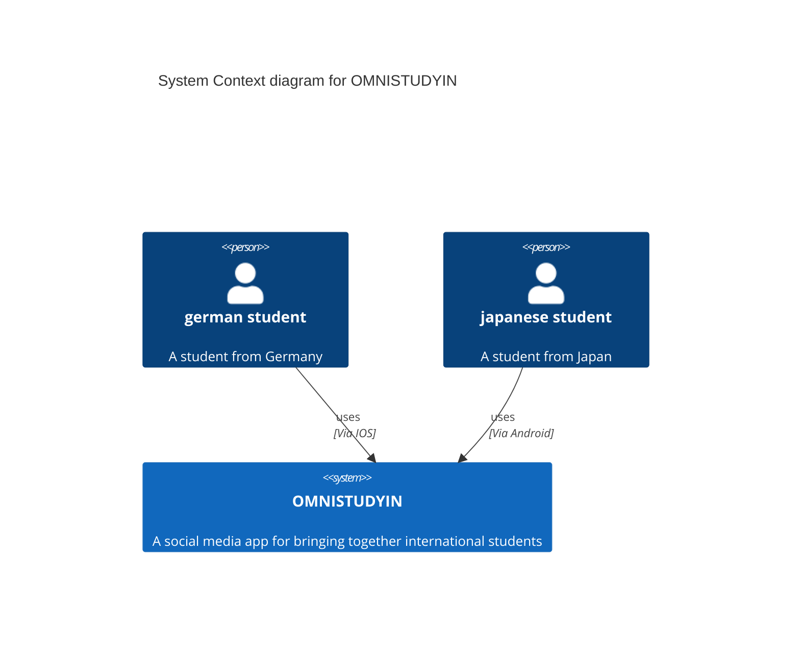
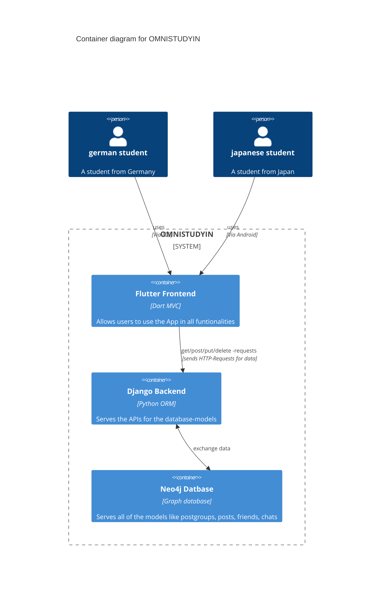
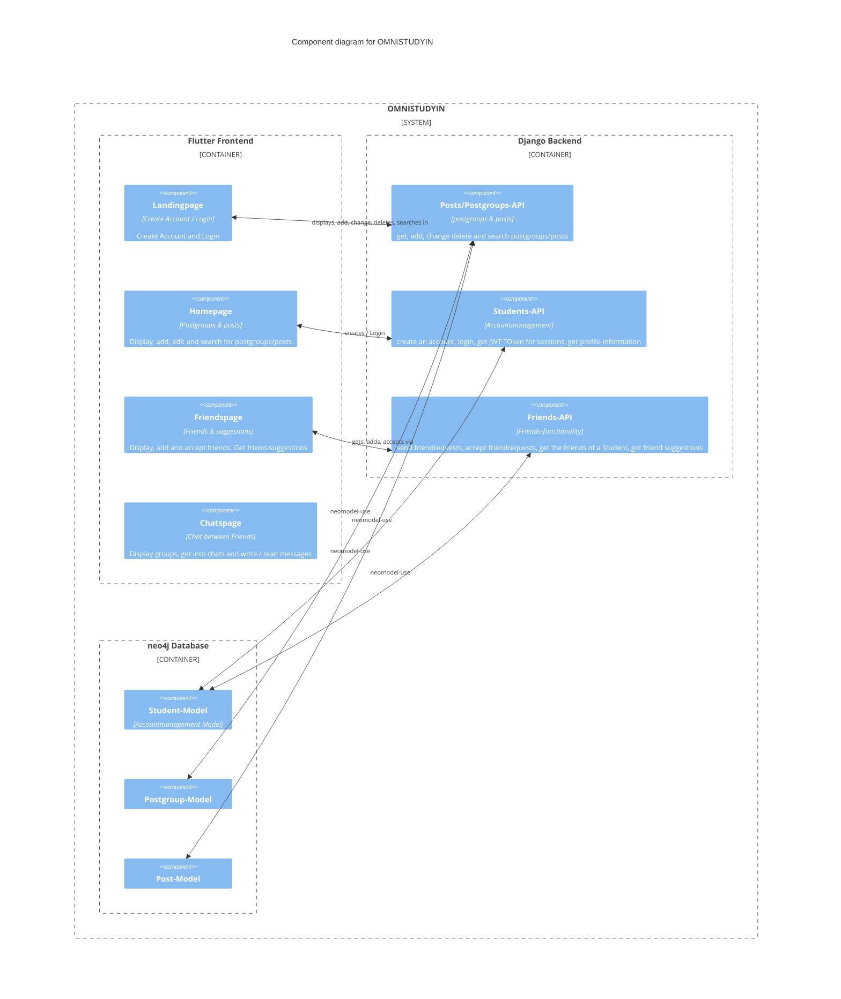

**"To connect international students and pave the way for meaningful relations online."**

## [About](#about)•[Techstack](#techstack)•[Quickstart](#quickstart)•[C4 Model](#c4-model)

# About

OMNISTUDYIN ist eine Social Media Handy-Applikation, die darauf abzielt, die Studenten unserer Welt zu verknüpfen.

Sie bietet die Folgenden Hauptfunktionalitäten:

- Ein Reddit-like "Posts"-System mit dem Erstellen und Anzeigen von Posts und Postgroups, sowie die Suche danach
- Ein Freundschaftssystem mit täglich neuen Freundschafts-Vorschlägen, basierend auf angegebenen Interessen/Zielen, für das internationalen Verknüpfen mit neuen Menschen
- Ein Chatsystem zum Interagieren mit anderen Menschen

# Techstack

Eine kurze highlevel-Beschreibung der benutzten Technologien in diesem Projekt

- Dieses Projekt benutzt das [Flutter-Framework](https://docs.flutter.dev/) für das Entwickeln von Cross-Plattform Apps (Android, IOS, Web) als Frontend.
- Für die persistente Datenbank wurde [Neo4j](https://neo4j.com/) ausgewählt. Diese NoSQL - Graph - Datenbank liefert eine übersichtliche Graphstruktur, welche Entititäten mittels Knoten darstellt und Beziehungen durch Kanten zwischen den Knoten abstrahiert. Somit ergibt sich ein übersichtliches Netzwerk innerhalb der Datenbank, die so **fast 1:1 die Social-media-Application wiederspiegelt**.
- Die Schnittstelle zwischen Flutter-Frontend und der Neo4j-Datenbank bildet das Python-Framework [Django](https://www.djangoproject.com/). Django unterstützt Neo4j nicht out-of-the-Box, deswegen wurde die [NeoModel](https://neomodel.readthedocs.io/en/latest/) Bibliothek benutzt.
- Das Django-Backend und die Datenbank wurde für eine übersichtliche und unkomplizierte Entwichlung mittels [Docker](https://docs.docker.com/) in unabhängige Container virtualisiert. Das Frontend wurde aufgrund der Benutzung von Offline-Handy-Emulatoren nicht zusätzlich virtualisiert.

# Quickstart

Folge diesen Schritten, um mit OMNISTUDYIN schnell auszuführen:

### Git Repository klonen

Klone das Repository, indem der folgende Befehl in der Kommandozeile oder im Terminal ausgeführt wird:

    git clone https://github.com/sk1ldpadde/OMNISTUDYIN.git

### Flutter installieren

Installiere Flutter gemäß der [offiziellen Flutter-Dokumentation](https://flutter.dev/docs/get-started/install).

### Docker Desktop installieren

Installiere Docker Desktop nach der Anleitung auf der [offiziellen Docker-Website](https://docs.docker.com/desktop/). Erstelle anschließend einen Account und starte die Anwendung.

### Setup-Skript ausführen

Navigiere in das geklonte Verzeichnis und führe die entsprechende Setup-Datei aus:

- Für Windows:

  ```
  .\SETUP.bat
  ```

- Für Linux/Mac:
  ```
  ./SETUP.sh
  ```

### Flutter Applikation starten

Wechsle in den Ordner `omnistudin_flutter` und führe den Befehl aus:

    flutter run

Nach diesen Schritten sollte die OMNISTUDYIN-App lauffähig sein.

# C4 Model

Dies ist das C4 Modell für das Projekt.

## [About](#about)•[Techstack](#techstack)•[Quickstart](#quickstart)•[C4 Model](#c4-model)

### System Context Diagram



### Container diagram



### Component diagram


