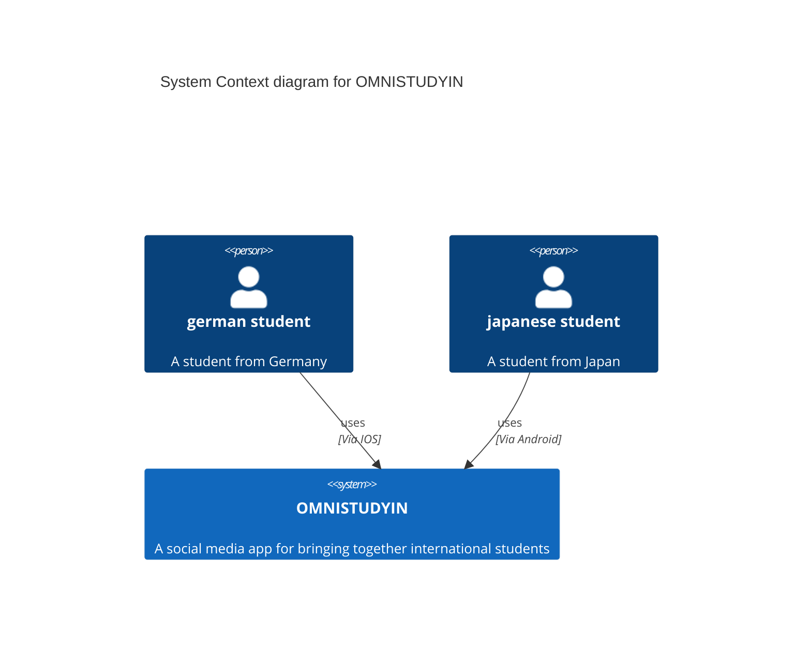
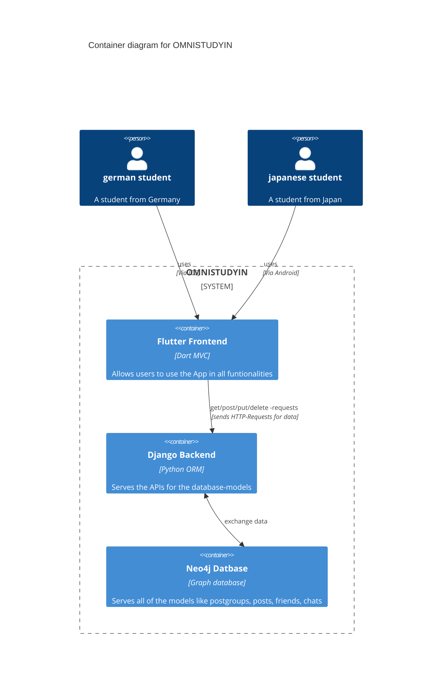
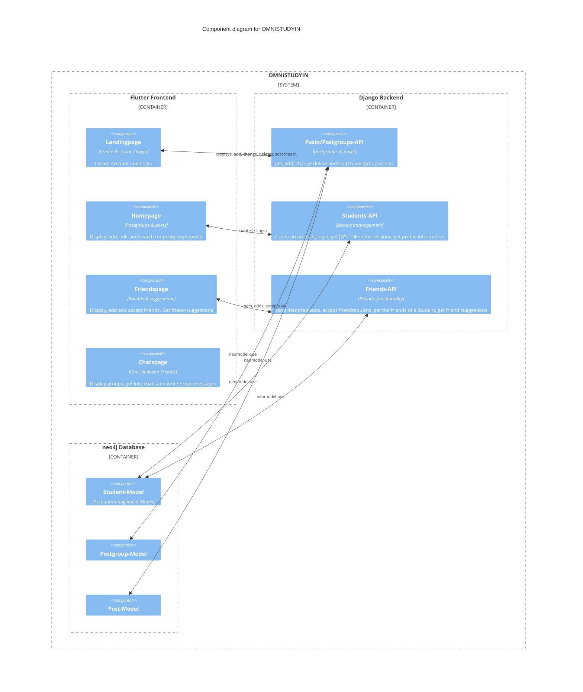
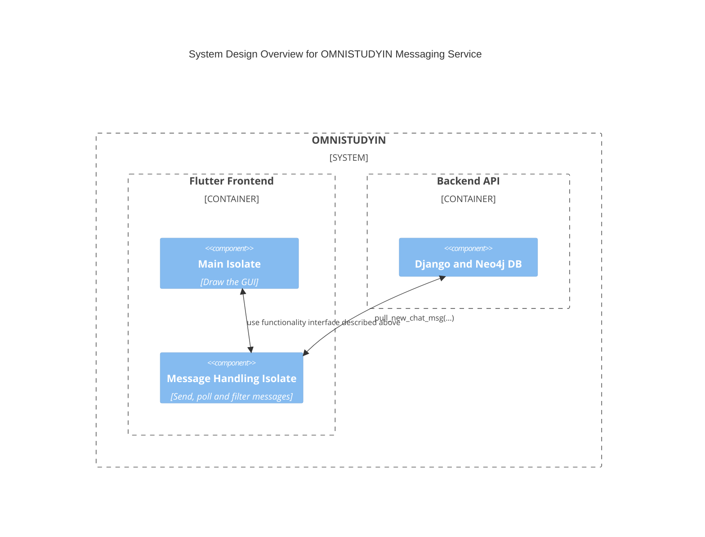

**"To connect international students and pave the way for meaningful relations online."**

## [About](#about)•[Techstack](#techstack)•[Quickstart](#quickstart)•[C4 Model](#c4-model)•[Contribute](#how-to-contribute)•[Lizenz](#lizenz)•[Sonstiges](#sonstiges)

# 💡 About

OMNISTUDYIN ist eine Social Media Handy-Applikation, die darauf abzielt, die Studenten unserer Welt zu verknüpfen.

Sie bietet die Folgenden Hauptfunktionalitäten:

- Ein Reddit-like "Posts"-System mit dem Erstellen und Anzeigen von Posts und Postgroups, sowie die Suche danach
- Ein Freundschaftssystem mit täglich neuen Freundschafts-Vorschlägen, basierend auf angegebenen Interessen/Zielen, für das internationalen Verknüpfen mit neuen Menschen
- Ein Chatsystem zum Interagieren mit anderen Menschen

# 👨‍💻 Techstack

Eine kurze highlevel-Beschreibung der benutzten Technologien in diesem Projekt

- Dieses Projekt benutzt das [Flutter-Framework](https://docs.flutter.dev/) für das Entwickeln von Cross-Plattform Apps (Android, IOS, Web) als Frontend.
- Für die persistente Datenbank wurde [Neo4j](https://neo4j.com/) ausgewählt. Diese NoSQL - Graph - Datenbank liefert eine übersichtliche Graphstruktur, welche Entititäten mittels Knoten darstellt und Beziehungen durch Kanten zwischen den Knoten abstrahiert. Somit ergibt sich ein übersichtliches Netzwerk innerhalb der Datenbank, die so **fast 1:1 die Social-media-Application wiederspiegelt**.
- Die Schnittstelle zwischen Flutter-Frontend und der Neo4j-Datenbank bildet das Python-Framework [Django](https://www.djangoproject.com/). Django unterstützt Neo4j nicht out-of-the-Box, deswegen wurde die [NeoModel](https://neomodel.readthedocs.io/en/latest/) Bibliothek benutzt.
- Das Django-Backend und die Datenbank wurde für eine übersichtliche und unkomplizierte Entwichlung mittels [Docker](https://docs.docker.com/) in unabhängige Container virtualisiert. Das Frontend wurde aufgrund der Benutzung von Offline-Handy-Emulatoren nicht zusätzlich virtualisiert.

# 🛫 Quickstart

Folge diesen Schritten, um mit OMNISTUDYIN schnell auszuführen:

### Git Repository klonen

Klone das Repository, indem der folgende Befehl in der Kommandozeile oder im Terminal ausgeführt wird:

    git clone https://github.com/sk1ldpadde/OMNISTUDYIN.git

### Flutter installieren

Installiere Flutter gemäß der [offiziellen Flutter-Dokumentation](https://flutter.dev/docs/get-started/install).

### Docker Desktop installieren

Installiere Docker Desktop nach der Anleitung auf der [offiziellen Docker-Website](https://docs.docker.com/desktop/). Erstelle anschließend einen Account und starte die Anwendung.

### Setup-Skript ausführen

Navigiere in das geklonte Verzeichnis und führe die entsprechende Setup-Datei aus:

- Für Windows:

  ```
  .\SETUP.bat
  ```

- Für Linux/Mac:
  ```
  ./SETUP.sh
  ```

### Flutter Applikation starten

Wechsle in den Ordner `omnistudin_flutter` und führe den Befehl aus:

    flutter run

Nach diesen Schritten sollte die OMNISTUDYIN-App lauffähig sein.

# 🧨 C4 Model

Dies ist das C4 Modell für das Projekt.
Für eine schönere Ansicht: Lightmode aktivieren!

#### [System Context Diagram](#system-context-diagram)•[Container Diagram](#container-diagram)•[Component Diagram](#component-diagram)

### System Context Diagram



### Container diagram



### Component diagram



# 🙏 How to contribute

Hier sind einige Richtlinien, wie man zum Projekt beitragen kann:

### Schritte zum Mitwirken

1. **Fork das Repository**  
   Beginne damit, das Projekt zu forken und dann deine Kopie lokal zu klonen.

2. **Erstelle einen neuen Branch**  
   Erstelle einen neuen Branch für jede Verbesserung oder Korrektur, z.B. `git checkout -b feature/meine-neue-funktion` oder `git checkout -b fix/bugfix`.

3. **Mache deine Änderungen**  
   Führe die Änderungen durch, die du für wichtig hältst. Stelle sicher, dass du deinen Code testest und dass er den bestehenden Richtlinien entspricht.

4. **Commit deine Änderungen**  
   Füge deine Änderungen mit `git add .` hinzu und erstelle einen Commit mit `git commit -m 'Füge eine nützliche Nachricht hinzu'`. Die Commit-Nachricht sollte klar und aussagekräftig sein.

5. **Push deinen Branch**  
   Lade deine Änderungen mit `git push origin feature/meine-neue-funktion` hoch.

6. **Erstelle einen Pull Request**  
   Gehe auf GitHub zu dem ursprünglichen Repository und erstelle einen Pull Request von deinem Fork. Beschreibe im Pull Request deine Änderungen und warum sie wichtig sind.

## Richtlinien

- Stelle sicher, dass dein Code den Stil- und Qualitätsstandards entspricht.
- Füge Tests hinzu, wenn du neue Funktionen implementierst.
- Aktualisiere die Dokumentation, wenn du Änderungen an der Funktionalität vornimmst.
- Verwende aussagekräftige Commit-Nachrichten.

Wir freuen uns auf alle Beiträge!

# ⚠️ Lizenz

Dieses Projekt ist unter der MIT-Lizenz lizenziert. Diese Lizenz ermöglicht es jedem, die Software für private oder kommerzielle Zwecke frei zu nutzen, zu verändern, zu verbreiten und zu verkaufen. Die MIT-Lizenz ist eine der permissivsten Lizenzen und legt nur sehr wenige Einschränkungen fest. Dabei muss lediglich der Urheberrechtshinweis und die Lizenzinformation in allen Kopien oder wesentlichen Teilen der Software erhalten bleiben.

Die vollständige Lizenztext der MIT-Lizenz kann [hier](https://opensource.org/licenses/MIT) eingesehen werden. Durch die Nutzung dieses Projekts stimmen Sie den Bedingungen der MIT-Lizenz zu.

Wir haben uns für die MIT-Lizenz entschieden, um die Nutzung und Weiterentwicklung der Software so offen und unkompliziert wie möglich zu gestalten. Wir ermutigen alle Nutzer, aktiv zur Verbesserung beizutragen und ihre Modifikationen mit der Gemeinschaft zu teilen.

# Sonstiges

## Overview

- [Sonstiges](#sonstiges)
  - [Retrospective](#retrospective)
  - [Where to find what](#where-to-find-what)
    - [Backend:](#backend)
      - [Views](#views)
      - [Backend-Algorithmen](#backend-algorithmen)
      - [Django](#django)
  - [Komplexere Algorithmen](#komplexere-algorithmen)
    - [Chat-System](#chat-system)
    -

## Retrospective

|                            ☀️                             |                            ☁️                            |           🔜            |
| :-------------------------------------------------------: | :------------------------------------------------------: | :---------------------: |
|      Implementierung von neo4j hat sehr gut geklappt      |           Frontend wurde zu langsam aufgebaut            | Mehr Frontend developer |
| Flutter lässt sich mittels Copilot sehr schnell schreiben |           Flutter an sich ist unnötig komplex            |   Mehr Dokumentation         |
|       Strukturierung des Teams verlief hervorragend       | Umstellung Linux/Mac für Backend Funktionalität stressig |           Mehr Code Kommentare            |
|Docker Einrichtung verlief ebenso reibungslos|||

## Where to find what

### Backend:

Der Ordner data_logic ist der Haupt-Ordner für die Backendlogik.
Hier findet man:

#### Views

In dem Ordner "views": Alle Algorithmen, die sich direkt mit API-Access beschäftigt

- Ad_Group: Get all groups, Creation, Deletion
- Ad: Get, Creation, Deletion, Changing of a ad in a adgroup --> Ein Ad muss eine parent-adgroup haben
- Students: Accountservice - Registering, Login (mit sessiontokens: JWT), sessiontoken-Updating, Change/Deletion von Accounts.
- Friends: Senden/Annehmen von Freundschaftsanfragen, Get all students, **find-friends-Algorithmus-view**
- Chat: Send-Chat-Message, Pull-Chat-Message

#### Backend-Algorithmen

Die meisten Backend-Algorithmen kann man in der Datei util.py finden.
Hier findet man:

- Algo, der das Alter eines Studenten berechnet
- Hashed passwort Vergleiche
- Profanity Check: Text nach Beleidigungen etc scannen
- Alle Sachen rund um SessionTokens: Java Web Tokens: Creation & Decoding von JWTs

#### Django

Der Omnistudyin_Backend-Ordner besitzt prinzipiell nur django-spezifische Inhalte.

- urls.py ist hier am wichtigsten, als Aufzählung der API-Points

## Komplexere Algorithmen

### ➡️ Patricia-Trie zur Inhaltssuche
Eine einfache, aber effiziente Inhaltssuche nach anderen Studenten oder Beiträgen (beides jeweils über den Namen) wird
mithilfe einer speziellen Indexstruktur umgesetzt.

Der **Patricia-Trie** ist eine spezielle Datenstruktur, die als Erweiterung des Prefix-Tree oder einfach "Trie" mehrere
Zeichen innerhalb eines Knotens zusammenfassen kann. Dies steigert die Effizienz enorm. Ein praktisches Anwendungsbeispiel,
indem eine solche Datenstruktur verwendet wird, ist Ethereum. Dort wird der gesamte World State, also alle persistenten Daten zu jedem Account in einer sog. "Patricia Merkle Trie" Struktur gehalten. 

In der folgenden Abbildung aus dem Wikipedia-Artikel zum Patricia-Trie, kann die Struktur und der Aufbau nachvollzogen werden. In dem Fall wurden sieben verschiedene Zeichenketten in die Struktur eingefügt. Gibt ein Nutzer beispielsweise folgende Suchanfrage ein "ro", so werden ihm umgehend die User "romane", "romanus" und "romulus" vorgeschlagen. 

> [!TIP]
> Die Suche kann dabei durch den Index in $O(n)$, wobei $n$ = Länge der Query (im Beispiel $n$ = 2) abgehandelt werden. 
> Eine lineare Suche über alle registrierten Studenten würde sich nicht skalieren lassen, wenn die Plattform Millionen von Nutzer hat.


Neu registrierte User sowie neu erstelle Ads und Ad-Gruppen können dem Index leicht hinzugefügt und wieder entfernt werden. Zur Implementierung verwendet, wurde das Python-Modul `pytrie` und die darin enthaltene Klasse `StringTrie`. Definiert ist die Implementierung in `data_logic/ptrie_structures.py`. Es werden jeweils zwei Klassen und damit zwei Strukturen definiert: `StudentsPTrie` und `AdsPTrie`.

#### Mögliche Erweiterung bzgl. System Design
Das gesamte Patricia-Trie Modul in einen eigenständigen Service auslagern, der sich nur um Suchanfragen kümmert. Außerdem eine persistente Speicherung der Indexstrukturen in einer Datenbank (beispielsweise Cassandra), um den Index nicht dauerhaft erneut aufbauen zu müssen.  

### ➡️ Chat-System
Es soll eine direkte Kommunikation zwischen zwei Studenten ermöglicht werden. Die Architektur wurde an jener von WhatsApp orientiert. Hauptargument ist dabei die lokale Speicherung der gesamten Chat-Daten auf den Geräten der jeweiligen Endnutzer. Lediglich der Austausch neuer Nachrichten geschieht über den Server. Folgendes Rechenbeispiel soll diese System-Design-Entscheidung bestärken:

> [!IMPORTANT]
> Alle Studenten weltweit: 7 Mio.   
> Durchschnittliche verschiedene Chatpartner pro Student: 15  
> Durchschnittliche Anzahl an Nachrichten pro Chat (nur Fotos und Videos): 50  
> Durchschnittliche Anzahl Bytes pro Nachricht (Foto oder Video): 2MB  
> Gesamtdatenmenge: 10 Pettabyte !!! (1 PB Storage bei Google Cloud kostet ca. 25k€/Monat)

Ein neuer Hintergrund-Service (in Flutter: Isolate, vergleichbar mit einem Thread, aber eigener Heap) wird aufgesetzt, um alle zwei Sekunden Polling durchzuführen und nach neuen Nachrichten zu fragen. Auch eigene Nachrichten können gesendet werden. Gespeichert werden die Nachrichten auf dem Server in der Graph-Datenbank. Ein User kann somit die mit seinen User-Knoten verbundenen Message-Knoten erfragen und erhalten. Nach Erhalt werden die Daten vom Server gelöscht. Das persistieren liegt nun in der Verantwortung der lokalen Anwendung. WhatsApp verwendet eine Sqlite Datenbank. Aus Zeitgründen werden die Daten zunächst in einer Textdatei persistiert. Die Schnittstelle, die der `Message Polling Service` bereitstellt (unter `omnistudin_flutter/lib/Logic/chat_message_service`) besteht in seiner Grundfunktionalität aus drei Funktionen: 

+ Eigene Nachricht senden: `sendOwnMessage(...)`
+ Alle lokal gespeicherten Nachrichten erhalten: `getMessages()`
+ Alle paarweise verschiedenen Chatpartner erhalten (nützlich für die Startseite): `getDistinctChatPartners()`
+ Alle Nachrichten bezüglich eines definierten Chatpartners erhalten: `getAllMessagesWith(...)`

#### Überblick: System Design des Chat-Systems


#### Mögliche Erweiterung bzgl. Security Aspekten
Um eine End-zu-End-Verschlüsselung, bei der die Nachricht lediglich von den beiden Gesprächspartnern gelesen werden kann, zu implementieren, ist eine PKI notwendig. Diese muss die öffentlichen Schlüssel der jeweiligen Teilnehmer speichern. Die jeweiligen Nachrichten können dann mit dem öffentlichen Schlüssel jener Person verschlüsselt werden, an die die Nachricht gerichtet ist. Diese kann die Nachricht anschließend mit ihrem geheimen, privaten Schlüssel entschlüsseln.  

### ➡️ Friend-Matching mit FAISS
Eine Hauptfunktionalität innerhalb der Anwendung ist das Vorschlagen von potenziellen Freunden auf Basis von ähnlichen Interessen der Studenten. FAISS (Facebook AI Similarity Search) bietet eine effiziente Möglichkeit die $n$ ähnlichsten Datenpunkte bzgl. eines gegebenen Datenpunkts zu erhalten (KNN). FAISS bietet dazu viele verschiedenen Indexstrukturen. Genutzt wird in diesem Projekt der `IndexFlatL2`. Dieser definiert eine exakte Brute-Force Suche basierend auf der euklidischen Norm (L2).

> [!NOTE]
> Eine Auflistung aller FAISS-Indices findet sich hier: (https://github.com/facebookresearch/faiss/wiki/Faiss-indexes)

Der wichtigste Vorgang, der das Endergebnis der Similarity Search am meisten beeinflusst, ist das Embedding. Die Datenpunkte (in unserem Fall die Studenten) müssen in einen hoch-dimensionalen Vektorraum eingebettet werden. Dabei soll die semantische Bedeutung der Daten erhalten bleiben. Wir verwenden `Word2Vec`, genauer gesagt ein Modell davon, welches mit Millionen von Google-Nachrichten trainiert wurde. Dabei werden jedoch lediglich einzelne Wörter definiert. Besser geeignet wäre eine Sentence-Library, beispielsweise `sentence-transformers`, die im Embedding alle Wörter und deren Beziehung zueinander berücksichtigt. Die Umstellung auf solch eine Sentence-Library wäre eine mögliche Optimierung, um beispielsweise auch die Bio eines Studenten berücksichtigen zu können.

Die Implementierung findet in `data_logic/views/views_friends.py` statt. Die Funktionen `find_friends` (als API-Endpoint) sowie `embed_student` für die Berechnung einer Vektor-Repräsentation eines Studenten (Embedding) sind relevant.

### ➡️ Passwort-Speicherung in der Datenbank
Unsere Passwort-Speicherung für die Studenten-Accounts basiert auf State-of-the-art Security-Standards. Die verwendete Hash-Funktion Argon2 ist eine sog. Slow-Hash-Funktion, deren Hashrate im Vergleich zu beispielsweise SHA sehr gering ist. In Kombination mit einem jeweils für jeden User zufällig neu generierten Salt, der dem Passwort hinzugefügt wird, sind Brute-Force-Attacken oder Rainbow-Table Neuberechnungen unattraktiv. 

[Reference](https://rohanhonwade.com/posts/argon-password-hashing/)
